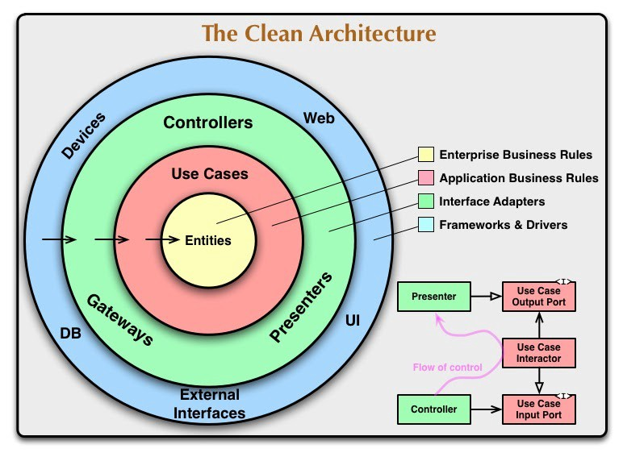

# Clean-architecture - Web Crawler Challenge
In this project I tried to build a personal approach on how to deal with Clean Architecture using Spring-Boot.
## Requirements Document

* #### [Web Crawler Project.pdf](src/main/resources/static/Web Crawler Project.pdf)

## About the Clean Architecture implementation


In this particular implementation I've created separated packages for the different tiers:
- **Domain** for Entities and Exceptions.
- **Service** for business logic and use cases.
- **Controller** for controller
- **Config** for all framework dependant stuff.

I removed Spring annotations from Services to decouple from Spring and I've added a configuration class for this purpose.

## About the Web Crawler Implementation

- I've created a WebPageCrawlerService.java interface. The interface has 2 different implementations:
  - SingleThreadedWebCrawlerServiceImpl.java
  - MultithreadedWebCrawlerServiceImpl.java (incomplete)
  Both implementations are based on  BFS algorithm


### Credits
* Jonathan Museri (jmuseri@hotmail.com)

## Building the project

Clone the project and use Maven to build the server

	$ mvn clean install

## Running the application locally

There are several ways to run a Spring Boot application on your local machine. One way is to execute the `main` method in the `com.museri.crawler.CrawlerChallengeApplication` class from your IDE.

Alternatively you can use the [Spring Boot Maven plugin](https://docs.spring.io/spring-boot/docs/current/reference/html/build-tool-plugins-maven-plugin.html) like so:

```shell
mvn spring-boot:run
```
The server will start on port 8080
	